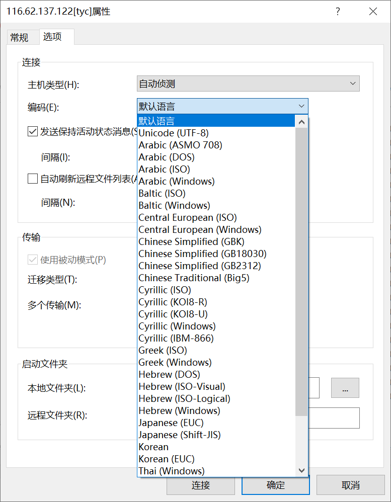
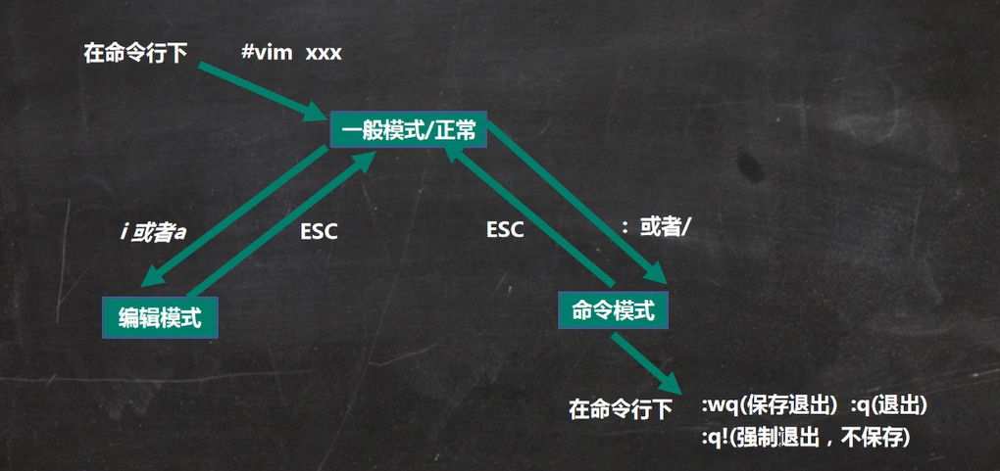
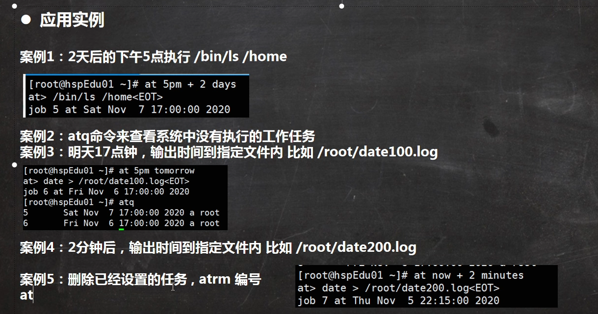
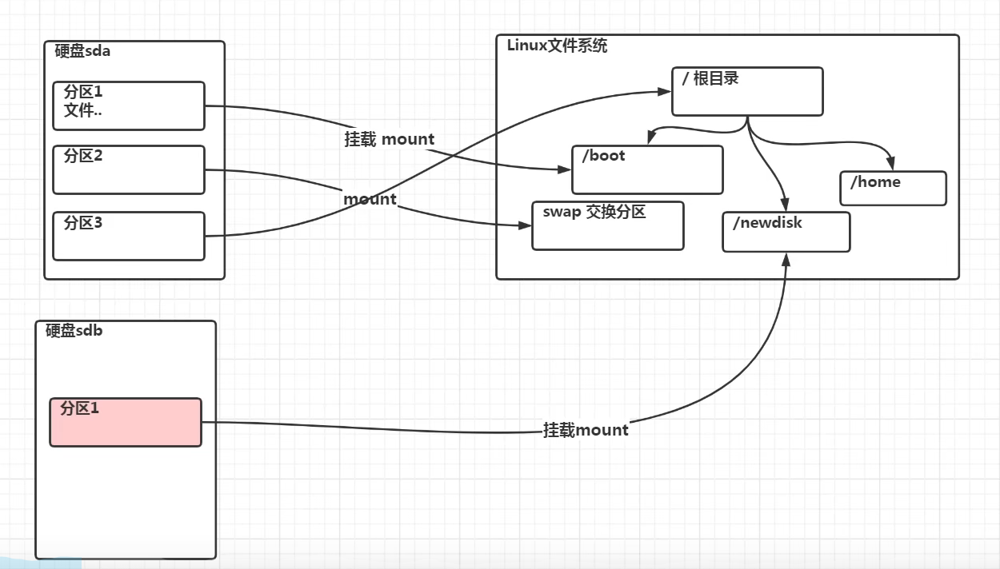
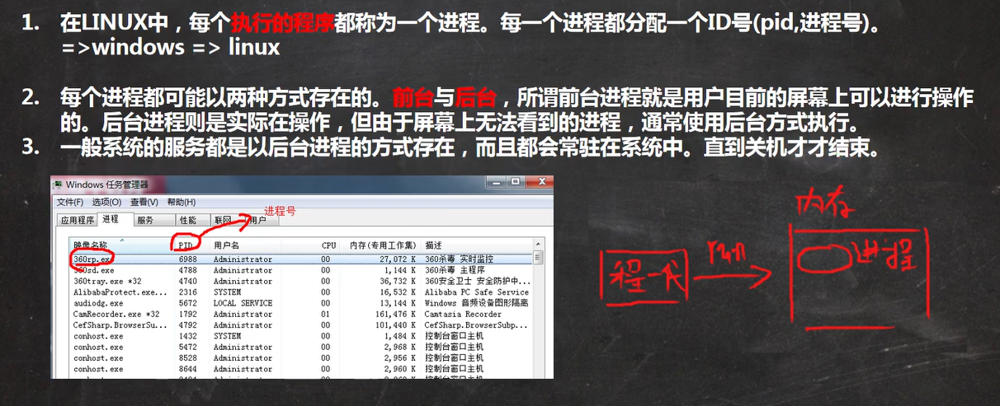
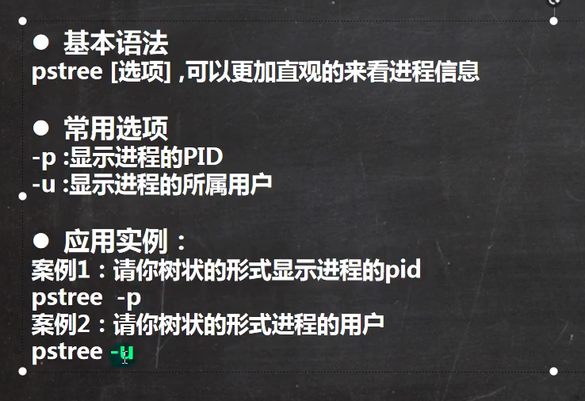
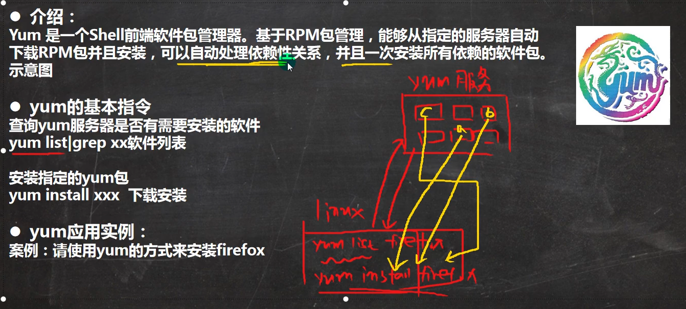
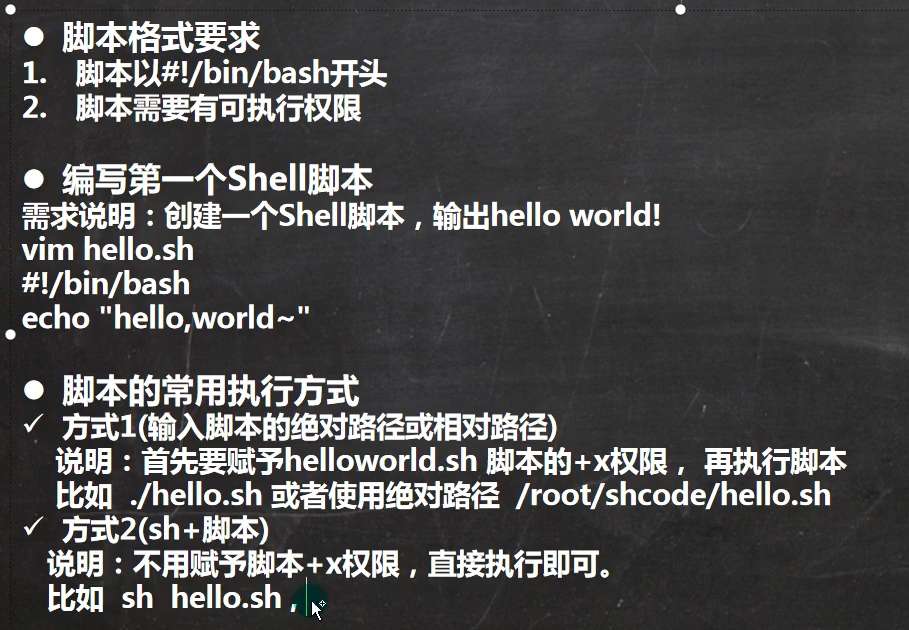
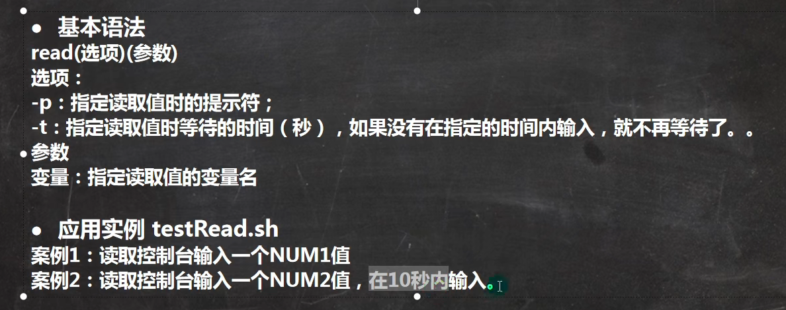
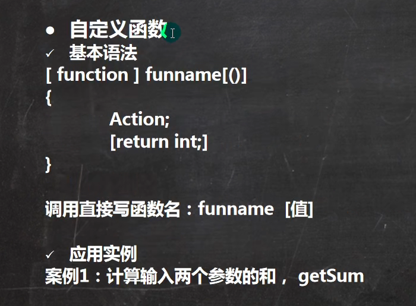

# 1. 概述

- B站韩顺平2021图解linux

  

- python专业开发平台——Ubuntu

  - linux定制python开发平台
  - Ubuntu配置python环境
  - Apt软件管理和远程登录

- Linux的三大应用

  
  - 服务器领域——应用最强c/c++/php/python/java/go
  - 嵌入式领域——物联网
  - 个人桌面领域

- 主要发行版

  - Ubuntu
  - RedHat
  - CentOs

- VM虚拟机的网络设置

  

- VM虚拟机的vmtools的安装使用

# 2. Linux的基本内容

- linux的文件系统是采用层级式的树状目录结构，在此结构的最上层是根目录“`/`”，然后再此目录下再创建其他的目录。
- 在linux的世界里，一切皆文件。cpu、磁盘、硬盘等等都会当成文件对待。
- linux的目录是规定好的，和windows可以随意设置盘符名称不一样，而且不同的目录的作用也各有安排，不可更改。
- 学习linux一定要熟记各个目录。

## 2.1 目录结构

- `/`: [**常用**]根目录。
- `/bin`: [**常用**]是binary的缩写，这个目录存放最经常使用的命令。所有用户都可以访问并执行的可执行程序。包括超级用户及一般用户。
  - `/usr/bin` 是系统安装时自带的一些可执行程序。即系统程序，轻易不要去动里面的东西，容易入坑。
  - `/usr/local/bin` 是用户自行编译安装时默认的可执行程序的安装位置，这个不小心误删点什么，不会影响大局。
- `/sbin`:s就是super user的意思，这里存放的是系统管理员使用的系统管理程序。
- `/home`: [**常用**]存放普通用户的主目录，在Linux中每个用户都有自己的目录，一般该里面的子目录名都以用户的账号命名。
- `/root`: [**常用**]该目录是系统管理员，也称为超级权限者的用户主目录。 
- `/ect`: [**常用**]这个目录里面是所有的系统管理所需要的配置文件和子目录，比如my.conf。
- `/usr`: [**常用**]这是一个非常重要的目录，用户的很多应用程序和文件都放在这个目录下，类似与Windows下的program files目录。
- `/boot`: [**常用**]存放的是启动Linux时使用的一些核心文件，包括一些链接文件以及镜像文件。
- `/media`: [**常用**]Linux系统会自动识别一些设备，例如U盘、光驱等等，当识别后，Linux会把识别到的设备挂载到这个目录下。
- `/mnt`: [**常用**]系统提供该目录是为了让用户临时挂载别的文件操作系统，我们可以将外部的存储挂载到`/mnt`上，然后进入这个目录就可以看到外部的存储内容了。注：vmtools可以共享windows的文件就在此目录下。
- `/opt`: [**常用**]这是给主机额外安装软件的安装包源码所摆放的位置，例如安装Oracle数据库的源码就一般约定俗成放到这个目录下，默认为空。
- `/usr/local`: [**常用**]这是给主机额外安装软件所安装的目录，是软件安装包的目标安装目录，一般通过编译源码的方式安装软件。
- `/var`: [**常用**]这个目录中存放着在不断扩充的东西，习惯将经常被修改的目录放在这个目录下，包括各种日志文件。
- `/proc`: [**别动**]这个目录是一个虚拟的目录，它是系统内存的映射 ，访问这个目录可以获取系统信息。
- `/srv`: [**别动**]这是service的缩写，该目录存放一些服务启动之后需要提取的数据。
- `/sys`: [**别动**]这是Linux2.6内核的一个很大的变化，该目录下安装了2.6内核中新出现的一个文件系统**sysfs**。
- `/tmp`: 这个目录是用来存放一些临时文件的。
- `/lib`: 系统开机所需要的最基本的动态链接共享库，其作用类似Windows的dll文件，几乎所有的应用程序都需要用到这些共享库。
- `/lost+found`:这个目录一般情况下是空的，当系统非法关机后，这里就存放了一些文件。
- `/dev`: 该目录类似Windows的设备管理器，把所有的硬件（例如磁盘、cpu、串口等）用文件的形式存储起来。
- `/selinux`: 该目录是security-enhanced linux的缩写，是一种安全子系统，类似windows上的360，它能控制程序只能访问特定文件，有三种工作模式，可以自行设置。

## 2.2 远程登录并传输文件到Linux

- [下载链接](https://www.xshell.com/zh/free-for-home-school/)
- 

- 使用Xshell远程登录

  

- 使用Xftp进行远程传输
- Xftp可能存在中文乱码的情况
  - 解决办法——更改软件编码
  - 

# 3. vi和vim快速入门

- Linux系统会内置vi文本编辑器。

- vim具有程序编辑的能力，可以看成是vi的增强版本，可以主动地以字体颜色辨别语法的正确性，方便程序设计，同时具备代码补全、编译和错误跳转等功能，因此被广泛程序员使用。

- 常用的三种模式

  

- 三种模式的相互转换

  - `!`表示强制，比如还有`wq!`。

  

- 快捷键图

  

## 3.1 正常模式下的快捷键

- 拷贝当前行`yy`；
- 拷贝n行`nyy`；注意小键盘数字不行，用自带的数字。
- 粘贴`p`；
- 删除这一行`dd`;
- 删除n行`ndd`；
- 跳转到第一行`gg`；
- 跳转到末尾行`G`；
- 撤销刚才的操作`u`；
- 跳转到第i行 `i+shift+g`；

## 3.2 命令模式下的快捷键

- 在命令模式下查找关键单词
  - 1.输入`/name`，name是你要查找的单词名
  - 2.按n查找下一个

- 在命令模式下设置行号`:set nu`；
- 在命令模式下删除行号`:set nonu`；

# 4. Linux开机、重启和用户登录注销

- 关机和重启

  - 注意，不管是重启系统还是关机，最好都执行一次sync指令，再重启或关机

  ~~~shell
  shutdown -h now #现在立即关机,h代表halt关机的意思
  shutdown -h 1  #1分钟后关机
  shutdown -r now #现在立即重启,r代表reboot
  halt #关机,作用和上面指令一样
  reboot #重启计算机
  sync #把内存数据同步到磁盘
  ~~~

- 用户注销

  

# 5. 用户管理

## 5.1 创建删除设置用户 

- Linux系统是一个多用户多任务的操作系统，任何一个想要使用系统资源的用户，都必须首先向系统管理员root申请一个账号，然后再以这个账号的身份进入系统。

- 添加用户默认该用户的家目录在`/home/username`，username是用户的名称，也可以指定目录，但没必要

- ~~~bash
  useradd milan #添加milan这个用户
  passwd milan #更改milan这个用户的密码
  userdel milan #删除用户milan，但是保留home家目录
  userdel -r milan #删除用户milan的所有信息，包括家目录
  ~~~

- 关于保留家目录的讨论

  - 建议保留
  - 除非不再需要该用户的任何贡献代码、记录

- `pwd`：该命令显示当前所在目录全程

## 5.2 查询切换用户

- 查询基本语法——`id 用户名`；当不存在改用户时，返回无此用户。

  - ~~~shell
    [root@iZbp1978lespq45h0qv20aZ home]# id jack
    id: jack: no such user
    [root@iZbp1978lespq45h0qv20aZ home]# id root
    uid=0(root) gid=0(root) groups=0(root)
    [root@iZbp1978lespq45h0qv20aZ home]# id milan
    uid=1000(milan) gid=1000(milan) groups=1000(milan)
    [root@iZbp1978lespq45h0qv20aZ home]# 
    ~~~

- 切换基本语法——`su 用户名`；`exit`返回原用户；从权限高的用户切换到权限低的用户，不需要密码；反之需要。

- 查看当前登录用户语法——`whoami`或者`who am i`。值得注意的是`whoami`返回当前使用的用户，`who am i`返回第一次登录服务器的信息。

  - ~~~bash
    [root@iZbp1978lespq45h0qv20aZ home]# ls
    milan
    [root@iZbp1978lespq45h0qv20aZ home]# su milan
    [milan@iZbp1978lespq45h0qv20aZ home]$ whoami
    milan
    [milan@iZbp1978lespq45h0qv20aZ home]$ exit
    exit
    [root@iZbp1978lespq45h0qv20aZ home]# whoami
    root
    [root@iZbp1978lespq45h0qv20aZ home]# who am i
    root     pts/0        2022-02-20 16:45 (43.227.139.42)
    [root@iZbp1978lespq45h0qv20aZ home]# su milan
    [milan@iZbp1978lespq45h0qv20aZ home]$ who am i
    root     pts/0        2022-02-20 16:45 (43.227.139.42)
    [milan@iZbp1978lespq45h0qv20aZ home]$ whoami
    milan
    [milan@iZbp1978lespq45h0qv20aZ home]$ exit
    exit
    [root@iZbp1978lespq45h0qv20aZ home]# 
    ~~~

## 5.3 用户组

- 增加组、删除组、创建特定组的用户
  
- 
  
- 移动用户到另外的组
  
- 
  
- 示例

  ~~~bash
  [root@iZbp1978lespq45h0qv20aZ home]# groupadd wudang
  [root@iZbp1978lespq45h0qv20aZ home]# groupdel wudang
  [root@iZbp1978lespq45h0qv20aZ home]# ls
  milan
  [root@iZbp1978lespq45h0qv20aZ home]# groupadd wudang
  [root@iZbp1978lespq45h0qv20aZ home]# useradd -g wudang zwj
  [root@iZbp1978lespq45h0qv20aZ home]# ls
  milan  zwj
  [root@iZbp1978lespq45h0qv20aZ home]# id zwj
  uid=1001(zwj) gid=1001(wudang) groups=1001(wudang)
  [root@iZbp1978lespq45h0qv20aZ home]# groupadd mojiao
  [root@iZbp1978lespq45h0qv20aZ home]# usermod -g mojiao zwj
  [root@iZbp1978lespq45h0qv20aZ home]# id zwj
  uid=1001(zwj) gid=1002(mojiao) groups=1002(mojiao)
  [root@iZbp1978lespq45h0qv20aZ home]# 
  
  ~~~

- 用户和组的相关文件

  - `cat /etc/group`：查看所有的组，一般大于1000是自定义；
  - `cat /etc/passwd`：查看所有的用户及其相关信息。

  

- 登录shell的含义 
  -  shell是你（用户）和Linux（或者更准确的说，是你和Linux内核）之间的接口程序。你在提示符下输入的每个命令都由shell先解释然后传给Linux内核。也称shell为外壳。
  - shell 是一个命令语言解释器（command-language interpreter）。拥有自己内建的 shell 命令集。此外，shell也能被系统中其他有效的Linux 实用程序和应用程序（utilities and application programs）所调用。
  - bash是shell的一种，是大多数Linux发行版默认的shell，除bash shell外还有c shell等其它类型的shell。
  - 

# 6. 实用指令

## 6.1 指定运行级别

- 运行级别一共有7种
  - 0：关机
  - 1：单用户，可以帮助找回丢失的密码
  - 2：多用户状态没有网络服务
  - 3：多用户状态有网络服务
  - 4：系统未使用保留给用户
  - 5：图形界面
  - 6：系统重启
- 常用运行级别是3和5，也可以指定默认运行级别。
- 切换运行级别
  
- 
  
- 修改默认运行级别

  - 在CentOs7以前，需要在`/ect/inittab`文件中修改。

  - CentOs7之后

    - 

    - ~~~bash
      [root@iZbp1978lespq45h0qv20aZ home]# cd /
      [root@iZbp1978lespq45h0qv20aZ /]# runlevel 
      N 3
      [root@iZbp1978lespq45h0qv20aZ /]# systemctl get-default
      multi-user.target
      [root@iZbp1978lespq45h0qv20aZ /]# systemctl set-default multi-user.target
      Removed symlink /etc/systemd/system/default.target.
      Created symlink from /etc/systemd/system/default.target to /usr/lib/systemd/system/multi-user.target.
      [root@iZbp1978lespq45h0qv20aZ /]# systemctl get-default
      multi-user.target
      [root@iZbp1978lespq45h0qv20aZ /]# runlevel 
      N 3
      ~~~

    - 即使用`runlevel` 查看当前运行级别，`systemctl get-default` 查看默认设置运行级别，`systemctl set-default multi-user.target` 设置默认运行级别的3。

## 6.2 找回root密码

- 思路：进入到单用户模式，就可以修改root密码
- 

- 

- 

## 6.3 帮助指令

- `man 命令或配置信息`
- `help 命令`

- 

## 6.4 文件操作指令

### 6.4.1 文件目录

- `pwd`：显示当前工作目录的绝对路径。

- `ls -a`或者`ls -l`：-a显示当前目录的所有文件和目录，包括隐藏的；-l表示以列表的方式显示信息；注意可以组合。

- `cd`：切换目录，后面可以是绝对路径或者相对路径，如果是`/`开头，表示绝对路径；否则为相对路径。

  - `cd ~`：回到自己的家目录；
  - `cd ..`：回到当前目录的上一级目录；
  - 

- ~~~bash
  [root@iZbp1978lespq45h0qv20aZ /]# ls
  bin   dev  home  lib64       media  opt   root  sbin  sys  usr
  boot  etc  lib   lost+found  mnt    proc  run   srv   tmp  var
  [root@iZbp1978lespq45h0qv20aZ /]# cd home/
  [root@iZbp1978lespq45h0qv20aZ home]# ls
  tom
  [root@iZbp1978lespq45h0qv20aZ home]# cd tom/
  [root@iZbp1978lespq45h0qv20aZ tom]# ls
  helo.txt
  [root@iZbp1978lespq45h0qv20aZ tom]# pwd
  /home/tom
  [root@iZbp1978lespq45h0qv20aZ tom]# cd ../../root
  [root@iZbp1978lespq45h0qv20aZ ~]# pwd
  /root
  [root@iZbp1978lespq45h0qv20aZ ~]# cd ..
  [root@iZbp1978lespq45h0qv20aZ /]# pwd
  /
  [root@iZbp1978lespq45h0qv20aZ /]# cd ~
  [root@iZbp1978lespq45h0qv20aZ ~]# pwd
  /root
  ~~~

### 6.4.2 文件创建删除

- `mkdir`：创建目录，默认创建一级目录，如果要创建多级，要加`-p`；

  - ~~~bash
    # 创建一个目录
    mkdir /home/dog
    #创建多级目录
    mkdir -p /home/animal/tiger
    ~~~

- `rmdir`：默认删除空目录，如果目录下有内容无法删除

- `rm -rf`：递归强制删除，可删除有内容的目录

  - ~~~bash
    [root@iZbp1978lespq45h0qv20aZ home]# ls
    animal  dog  tom
    [root@iZbp1978lespq45h0qv20aZ home]# rmdir dog/
    [root@iZbp1978lespq45h0qv20aZ home]# ls
    animal  tom
    [root@iZbp1978lespq45h0qv20aZ home]# rm -rf animal/
    [root@iZbp1978lespq45h0qv20aZ home]# ls
    tom
    ~~~

- `touch`：创建一个空文件

  - ~~~bash
    touch hello.txt
    ~~~

### 6.4.3 文件拷贝删除移动查看

- `cp 文件 拷贝路径`：拷贝文件到指定路径

- `cp -r 文件夹 拷贝路径`：递归拷贝文件夹到指定路径

- `\cp`：强制覆盖不提示拷贝

  - ~~~bash
    [root@iZbp1978lespq45h0qv20aZ home]# ls
    hello1.txt  test  tom
    [root@iZbp1978lespq45h0qv20aZ home]# cp hello1.txt test/
    [root@iZbp1978lespq45h0qv20aZ home]# ls
    hello1.txt  test  tom
    [root@iZbp1978lespq45h0qv20aZ home]# cd test/
    [root@iZbp1978lespq45h0qv20aZ test]# ls
    hello1.txt
    [root@iZbp1978lespq45h0qv20aZ test]# cp -r /home/test/ /opt/
    ~~~

  - 

- `rm 文件或目录`：删除文件

- `rm -r 文件夹`：递归删除整个文件夹

- `rm -f`：强制删除不显示

  - ~~~bash
    [root@iZbp1978lespq45h0qv20aZ test]# ls
    hello1.txt  hello2.txt
    [root@iZbp1978lespq45h0qv20aZ test]# rm hello1.txt 
    rm: remove regular empty file ‘hello1.txt’? y
    [root@iZbp1978lespq45h0qv20aZ test]# rm -f hello2.txt 
    [root@iZbp1978lespq45h0qv20aZ test]# ls
    [root@iZbp1978lespq45h0qv20aZ test]# cd ~
    [root@iZbp1978lespq45h0qv20aZ ~]# ls
    Hello.cpp
    [root@iZbp1978lespq45h0qv20aZ ~]# cd /opt
    [root@iZbp1978lespq45h0qv20aZ opt]# ls
    test
    [root@iZbp1978lespq45h0qv20aZ opt]# rm -r test/
    rm: remove directory ‘test/’? y
    [root@iZbp1978lespq45h0qv20aZ opt]# ls
    [root@iZbp1978lespq45h0qv20aZ opt]# cd /home
    [root@iZbp1978lespq45h0qv20aZ home]# ls
    hello1.txt  test  tom
    [root@iZbp1978lespq45h0qv20aZ home]# rm -f hello1.txt 
    [root@iZbp1978lespq45h0qv20aZ home]# rm -r test/
    rm: descend into directory ‘test/’? y
    rm: remove regular empty file ‘test/hello2.txt’? y
    rm: remove regular empty file ‘test/hello1.txt’? y
    rm: remove directory ‘test/’? y
    [root@iZbp1978lespq45h0qv20aZ home]# ls
    tom
    ~~~

  - 

- `mv src tar`：移动文件或者重命名文件

  - ~~~bash
    mv cat.txt pig.txt  #重命名文件
    mv pig.txt /home/cat.txt #移动文件并且重命名
    mv /opt/bbb/ /home/  #移动bbb这个文件夹
    mv /opt/bbb/ /home/ccc #移动bbb这个文件夹并且重命名
    ~~~

  - 

- `cat`：查看文件内容

  - 其实`vim` 也可以查看文件内容，但不同的是，vim是可编辑的，cat只能浏览，相对来说更安全。
  - 一般cat会带上管道命令`| more`以方便浏览，管道命令是指上一个指令得到的结果交给下一个指令结果，类似两个指令的结合。

  - `cat -n /etc/profile | more`：-n表示显示行号。
  - 

- `more`：例如`more /etc/profile`。以全屏按页显示文本文件内容。
  
- 
  
- `less`：用来分屏查看文件内容，和`more`功能类似，但比more功能更强大。
  
- 
  
- `echo`：输出内容到控制台

  - `echo $HOSTNAME`：输出主机名

  - `echo $PATH`：输出环境变量

  - ~~~bash
    [root@iZbp1978lespq45h0qv20aZ ~]# echo $HOSTNAME 
    iZbp1978lespq45h0qv20aZ
    [root@iZbp1978lespq45h0qv20aZ ~]# echo $PATH 
    /usr/local/sbin:/usr/local/bin:/usr/sbin:/usr/bin:/root/bin
    ~~~

- `head`：用于显示文件的开头部分内容，默认情况显示前10行

  - `head -n 5 /etc/profile`：查看文件前5行

- `tail`：用于显示文件的尾部内容，默认显示最后10行

  - `tail -n 5 /etc/profile`：查看文件后5行
  - `tail -f 文件名`：实时追踪文档的所有更新，退出按`ctrl+C`，适用于网络抓包、服务器网络监视
  - 

- `>` 输出重定向（覆盖原文件）和 `>>` 追加

  - ~~~bash
    [root@iZbp1978lespq45h0qv20aZ ~]# ls -l /home
    total 4
    -rw-r--r-- 1 root root    0 Feb 21 12:28 cat.txt
    drwx------ 2 tom  tom  4096 Feb 21 14:35 tom
    [root@iZbp1978lespq45h0qv20aZ ~]# ls -l /home >/home/info.txt
    [root@iZbp1978lespq45h0qv20aZ ~]# cd /home/
    [root@iZbp1978lespq45h0qv20aZ home]# ls
    cat.txt  info.txt  tom
    [root@iZbp1978lespq45h0qv20aZ home]# cat info.txt 
    total 4
    -rw-r--r-- 1 root root    0 Feb 21 12:28 cat.txt
    -rw-r--r-- 1 root root    0 Feb 21 16:04 info.txt
    drwx------ 2 tom  tom  4096 Feb 21 14:35 tom
    [root@iZbp1978lespq45h0qv20aZ home]# ls
    cat.txt  info.txt  tom
    [root@iZbp1978lespq45h0qv20aZ home]# cal >> info.txt 
    [root@iZbp1978lespq45h0qv20aZ home]# cat info.txt 
    total 4
    -rw-r--r-- 1 root root    0 Feb 21 12:28 cat.txt
    -rw-r--r-- 1 root root    0 Feb 21 16:04 info.txt
    drwx------ 2 tom  tom  4096 Feb 21 14:35 tom
        February 2022   
    Su Mo Tu We Th Fr Sa
           1  2  3  4  5
     6  7  8  9 10 11 12
    13 14 15 16 17 18 19
    20 21 22 23 24 25 26
    27 28
    
    [root@iZbp1978lespq45h0qv20aZ home]# 
    ~~~

  - 

- `ln`：表示link的意思，软链接，也称为符号链接，类似Windows里面的快捷方式，主要存放了链接其他文件的路径。

  - 删除不能加`/`，把他当成一个文件，而不是目录；

  - `pwd`显示的是当前的路径，而不是链接的路径，但是显示的内容是链接的内容。

  - ~~~bash
    [root@iZbp1978lespq45h0qv20aZ home]# ls
    cat.txt  tom
    [root@iZbp1978lespq45h0qv20aZ home]# ln -s /root/ myroot
    [root@iZbp1978lespq45h0qv20aZ home]# ls -l
    total 4
    -rw-r--r-- 1 root root    0 Feb 21 12:28 cat.txt
    lrwxrwxrwx 1 root root    6 Feb 21 16:16 myroot -> /root/
    drwx------ 2 tom  tom  4096 Feb 21 14:35 tom
    [root@iZbp1978lespq45h0qv20aZ home]# cd myroot/
    [root@iZbp1978lespq45h0qv20aZ myroot]# pwd
    /home/myroot
    [root@iZbp1978lespq45h0qv20aZ myroot]# ls
    Hello.cpp
    [root@iZbp1978lespq45h0qv20aZ myroot]# cd /home/
    [root@iZbp1978lespq45h0qv20aZ home]# ls -l
    total 4
    -rw-r--r-- 1 root root    0 Feb 21 12:28 cat.txt
    lrwxrwxrwx 1 root root    6 Feb 21 16:16 myroot -> /root/
    drwx------ 2 tom  tom  4096 Feb 21 14:35 tom
    [root@iZbp1978lespq45h0qv20aZ home]# rm myroot/
    rm: cannot remove ‘myroot/’: Is a directory
    [root@iZbp1978lespq45h0qv20aZ home]# rm myroot
    rm: remove symbolic link ‘myroot’? y
    [root@iZbp1978lespq45h0qv20aZ home]# ls -l
    total 4
    -rw-r--r-- 1 root root    0 Feb 21 12:28 cat.txt
    drwx------ 2 tom  tom  4096 Feb 21 14:35 tom
    ~~~

  - 

- `history`：查看已经执行过的历史命令

  - `!n`：执行编号为n的历史命令。

  - ~~~bash
    [root@iZbp1978lespq45h0qv20aZ home]# history 10
      295  cd myroot/
      296  pwd
      297  ls
      298  cd /home/
      299  ls -l
      300  rm myroot/
      301  rm myroot
      302  ls -l
      303  history 
      304  history 10
    [root@iZbp1978lespq45h0qv20aZ home]# !302
    ls -l
    total 4
    -rw-r--r-- 1 root root    0 Feb 21 12:28 cat.txt
    drwx------ 2 tom  tom  4096 Feb 21 14:35 tom
    [root@iZbp1978lespq45h0qv20aZ home]# 
    ~~~

  - 

## 6.5 时间日期指令

- `date`：显示当前日期

  - ~~~bash
    [root@Tyc ~]# date
    Mon Feb 21 18:32:52 CST 2022
    [root@Tyc ~]# date "+%Y-%m-%d"
    2022-02-21
    [root@Tyc ~]# date "+%Y-%m-%d %H:%M:%S"
    2022-02-21 18:34:03
    ~~~

  - 

  - `date -s "2021-11-03 20:02:03"`：设置系统时间

- `cal`：显示本月月历

  - `cal 2020`：显示2020年的所有月历
  - 

## 6.6 查找指令

- `find 搜索范围 选项`：从指定目录向下递归的遍历子目录，将满足的文件或目录显示在终端
  
- 
  
- `locate`：可以利用数据库快速实现文件搜索，但有的linux没有安装，先安装`yum install mlocate`，然后再使用之前更新数据库`updatedb`，才能使用locate。

  - ~~~bash
    [root@Tyc /]# updatedb
    [root@Tyc /]# locate Hello.cpp
    /root/Hello.cpp
    ~~~

  - 

- `which`：可以查看某个指令在哪个目录下。

  - ~~~bash
    [root@Tyc /]# which ls
    alias ls='ls --color=auto'
    	/usr/bin/ls
    [root@Tyc /]# which man
    /usr/bin/man
    [root@Tyc /]# which cd
    /usr/bin/cd
    ~~~

- `grep`：过滤查找，通常和管道符号`|` 一起使用。

  - 基本语法`grep -n "内容" 文件`；-n表示显示匹配的行号。

  - 基本语法`grep -i "内容" 文件`；-i表示忽略字母大小写。

  - ~~~bash
    [root@Tyc home]# cat test.txt 
    hello 
    yes
    dp
    home
    dp
    yes
    yes
    hale
    kkk
    yes
    test
    [root@Tyc home]# cat test.txt | grep -n "yes" 
    2:yes
    6:yes
    7:yes
    10:yes
    [root@Tyc home]# grep -n "yes" test.txt 
    2:yes
    6:yes
    7:yes
    10:yes
    [root@Tyc home]# 
    ~~~

  - 

##  6.7 压缩和解压指令

- `gzip`和`gunzip`：对单个文件进行压缩和解压，格式是`.gz`。

  - ~~~bash
    [root@Tyc home]# ls
    cat.txt  test.txt  tom
    [root@Tyc home]# gzip test.txt 
    [root@Tyc home]# ls
    cat.txt  test.txt.gz  tom
    [root@Tyc home]# gunzip test.txt.gz 
    [root@Tyc home]# ls
    cat.txt  test.txt  tom
    ~~~

  - 

- `zip`和`unzip`：对文件夹压缩和解压，格式是`.zip`。

  - `zip -r myhome.zip /home/`：压缩home文件夹以及其里面的文件和子文件夹成为myhome.zip

  - `unzip -d /opt/temp /home/myhome.zip` ：-d表示指定的解压目录

  - ~~~bash
    [root@Tyc home]# ls
    cat.txt  test.txt  tom
    [root@Tyc home]# zip -r myhome.zip /home/
      adding: home/ (stored 0%)
      adding: home/cat.txt (stored 0%)
      adding: home/tom/ (stored 0%)
      adding: home/tom/.bashrc (deflated 23%)
      adding: home/tom/helo.txt (stored 0%)
      adding: home/tom/.bash_profile (deflated 21%)
      adding: home/tom/.bash_logout (stored 0%)
      adding: home/test.txt (deflated 19%)
    [root@Tyc home]# ls
    cat.txt  myhome.zip  test.txt  tom
    [root@Tyc home]# unzip -d /opt/temp myhome.zip 
    Archive:  myhome.zip
       creating: /opt/temp/home/
     extracting: /opt/temp/home/cat.txt  
       creating: /opt/temp/home/tom/
      inflating: /opt/temp/home/tom/.bashrc  
     extracting: /opt/temp/home/tom/helo.txt  
      inflating: /opt/temp/home/tom/.bash_profile  
     extracting: /opt/temp/home/tom/.bash_logout  
      inflating: /opt/temp/home/test.txt  
    [root@Tyc home]# cd /ope/te
    -bash: cd: /ope/te: No such file or directory
    [root@Tyc home]# cd /opt/temp/
    [root@Tyc temp]# ls
    home
    ~~~

  - 

- `tar`：既可以压缩，也可以解压，打包得到的文件格式是`.tar.gz` 。

  - `tar -zcvf xxx.tar.gz 打包内容`：将内容进行打包

  - `tar -zxvf xxx.tar.gz -C 解压目标目录`：将压缩文件解压到特点位置

  - 

  - ~~~bash
    [root@Tyc home]# ls
    cat.txt  pig.txt  test.txt  tiger.txt  tom
    [root@Tyc home]# tar -zcvf pt.tar.gz pig.txt tiger.txt 
    pig.txt
    tiger.txt
    [root@Tyc home]# ls
    cat.txt  pig.txt  pt.tar.gz  test.txt  tiger.txt  tom
    [root@Tyc home]# mkdir /opt/temp2
    [root@Tyc home]# tar -zxvf pt.tar.gz -C /opt/temp2/ 
    pig.txt
    tiger.txt
    [root@Tyc home]# cd /opt/temp2/
    [root@Tyc temp2]# ls
    pig.txt  tiger.txt
    [root@Tyc temp2]# tar -zcvf myhome.tar.gz /home 
    tar: Removing leading `/' from member names
    /home/
    /home/cat.txt
    /home/pt.tar.gz
    /home/tom/
    /home/tom/.bashrc
    /home/tom/helo.txt
    /home/tom/.bash_profile
    /home/tom/.bash_logout
    /home/tiger.txt
    /home/pig.txt
    /home/test.txt
    [root@Tyc temp2]# ls
    myhome.tar.gz  pig.txt  tiger.txt
    [root@Tyc temp2]# tar -zxvf myhome.tar.gz 
    home/
    home/cat.txt
    home/pt.tar.gz
    home/tom/
    home/tom/.bashrc
    home/tom/helo.txt
    home/tom/.bash_profile
    home/tom/.bash_logout
    home/tiger.txt
    home/pig.txt
    home/test.txt
    [root@Tyc temp2]# ls
    home  myhome.tar.gz  pig.txt  tiger.txt
    [root@Tyc temp2]# 
    ~~~

# 7. 组管理和权限管理

## 7.1 用户和文件的组概念

- Linux每个用户都必须属于一个组，就像每个人都有自己的国家一样。

- Linux每个文件都有**所有者**、**所在组**、**其他组**这三个概念。

  

  

- 修改权限一般要`root`权限。

## 7.2 文件和目录的所有者

- `chown -R` ：change owner，修改所有者。-R表示递归修改。
- 

- 

- ~~~bash
  [root@Tyc home]# ls -ahl
  total 16K
  drwxr-xr-x.  3 root root 4.0K Feb 22 18:46 .
  dr-xr-xr-x. 18 root root 4.0K Feb 19 20:40 ..
  -rw-r--r--   1 root root    0 Feb 22 18:46 apple.txt
  -rw-r--r--   1 root root    0 Feb 21 12:28 cat.txt
  -rw-r--r--   1 root root    0 Feb 21 19:59 pig.txt
  -rw-r--r--   1 root root   48 Feb 21 19:11 test.txt
  -rw-r--r--   1 root root    0 Feb 21 19:59 tiger.txt
  drwx------   2 tom  tom  4.0K Feb 21 14:35 tom
  [root@Tyc home]# chown tom apple.txt 
  [root@Tyc home]# ls -ahl
  total 16K
  drwxr-xr-x.  3 root root 4.0K Feb 22 18:46 .
  dr-xr-xr-x. 18 root root 4.0K Feb 19 20:40 ..
  -rw-r--r--   1 tom  root    0 Feb 22 18:46 apple.txt
  -rw-r--r--   1 root root    0 Feb 21 12:28 cat.txt
  -rw-r--r--   1 root root    0 Feb 21 19:59 pig.txt
  -rw-r--r--   1 root root   48 Feb 21 19:11 test.txt
  -rw-r--r--   1 root root    0 Feb 21 19:59 tiger.txt
  drwx------   2 tom  tom  4.0K Feb 21 14:35 tom
  [root@Tyc home]# 
  ~~~

## 7.3 组的创建

- ~~~bash
  groupadd master # 创建一个组master
  useradd -g master fox #创建一个用户放到master组下面
  ~~~

## 7.4 文件和目录的所在组

- `chgrp -R`：change group，修改所在组。-R表示递归修改。
- 
- 

- ~~~bash
  [root@Tyc tom]# ls -ahl
  total 24K
  drwx------  2 tom  tom  4.0K Feb 22 19:00 .
  drwxr-xr-x. 3 root root 4.0K Feb 22 18:46 ..
  -rw-------  1 tom  tom   123 Feb 22 19:00 .bash_history
  -rw-r--r--  1 tom  tom    18 Apr  1  2020 .bash_logout
  -rw-r--r--  1 tom  tom   193 Apr  1  2020 .bash_profile
  -rw-r--r--  1 tom  tom   231 Apr  1  2020 .bashrc
  -rw-rw-r--  1 tom  tom     0 Feb 22 18:55 tom1.txt
  [root@Tyc tom]# chgrp master tom1.txt 
  [root@Tyc tom]# ls -ahl
  total 24K
  drwx------  2 tom  tom    4.0K Feb 22 19:00 .
  drwxr-xr-x. 3 root root   4.0K Feb 22 18:46 ..
  -rw-------  1 tom  tom     123 Feb 22 19:00 .bash_history
  -rw-r--r--  1 tom  tom      18 Apr  1  2020 .bash_logout
  -rw-r--r--  1 tom  tom     193 Apr  1  2020 .bash_profile
  -rw-r--r--  1 tom  tom     231 Apr  1  2020 .bashrc
  -rw-rw-r--  1 tom  master    0 Feb 22 18:55 tom1.txt
  [root@Tyc tom]# 
  ~~~

## 7.5 其他组

- ~~~bash
  [root@Tyc tom]# usermod -g wudang tom
  [root@Tyc tom]# id tom
  uid=1000(tom) gid=1001(wudang) groups=1001(wudang)
  [root@Tyc tom]# 
  ~~~

- 

## 7.6 权限的基本介绍

- 使用`ls -l`得出的信息，开头10个字符表示文件权限
  - 第0位确定文件类型（`d,-,l,c,b`）
    - `d` 表示目录；
    - `-` 表示普通文件;
    - `c` 表示字符设备文件，如鼠标、键盘等；
    - `b` 表示块设备，比如硬盘等，blog。
  - 第1-3位确定所有者所拥有的权限；
    - `rwx` 三种权限，对于文件和目录的作用分别不用。
  - 第4-6位确定所在组的权限；
  - 第7-9位确定其他用户所拥有的权限。
- 

- 

- 可删除文件的前提要对文件所在目录有`w`权限，同时对文件有`w`权限。
- 示例
  - 

## 7.7 修改权限

- `chmod`：修改文件或目录的文件。
- 

- 也可以通过数字更改权限，1-7 包含的所有的组合方式。

  

# 8. 定时任务调度

## 8.1 crond 任务调度

- 为什么要定时调度

  

- 

- 

- 注意星号之间要有间隔

  - ~~~bash
    */1 * * * * ls -l /etc/ > /tmp/to.txt
    ~~~

- 

- 

### crontab使用脚本应用实例

- 第一步：添加mywork.sh 脚本

- 第二步：添加sh脚本的执行权限

- 第三步：添加定时任务

  ~~~bash
  [root@Tyc home]# vim mywork.sh
  [root@Tyc home]# chmod u+x mywork.sh 
  [root@Tyc home]# ll
  total 12
  -rw-r--r-- 1 tom  root      0 Feb 22 18:46 apple.txt
  -rw-r--r-- 1 root root      0 Feb 21 12:28 cat.txt
  -rwxr--r-- 1 root root     39 Feb 22 20:42 mywork.sh
  -rw-r--r-- 1 root root      0 Feb 21 19:59 pig.txt
  -rw-r--r-- 1 root root     48 Feb 21 19:11 test.txt
  -rw-r--r-- 1 root root      0 Feb 21 19:59 tiger.txt
  drwx------ 2 tom  wudang 4096 Feb 22 19:00 tom
  [root@Tyc home]# crontab -e
  no crontab for root - using an empty one
  crontab: installing new crontab
  [root@Tyc home]# crontab -l
  */1 * * * * /home/mywork.sh
  [root@Tyc home]# ll
  total 16
  -rw-r--r-- 1 tom  root      0 Feb 22 18:46 apple.txt
  -rw-r--r-- 1 root root      0 Feb 21 12:28 cat.txt
  -rw-r--r-- 1 root root    162 Feb 22 20:45 mycal
  -rwxr--r-- 1 root root     39 Feb 22 20:42 mywork.sh
  -rw-r--r-- 1 root root      0 Feb 21 19:59 pig.txt
  -rw-r--r-- 1 root root     48 Feb 21 19:11 test.txt
  -rw-r--r-- 1 root root      0 Feb 21 19:59 tiger.txt
  drwx------ 2 tom  wudang 4096 Feb 22 19:00 tom
  ~~~

- 

## 8.2 at 定时任务

- crond是定时、反复执行的。

- at命令是一次性定时计划任务。

- 启动的前提是看at的守护进程atd是否在运行

  - 查看指令是`ps -ef | grep atd `。

  - ~~~bash
    [root@Tyc home]# ps -ef | grep atd
    root      1089     1  0 Feb21 ?        00:00:00 /usr/sbin/atd -f
    ~~~

- 

- 

- ~~~bash
  [root@Tyc home]# atq
  [root@Tyc home]# at 5pm tomorrow
  at> date > /home/test.log<EOT>
  job 1 at Wed Feb 23 17:00:00 2022
  [root@Tyc home]# atq
  1	Wed Feb 23 17:00:00 2022 a root
  [root@Tyc home]# 
  ~~~

- `at+选项+时间`之后输入`回车`，然后输入指令，最后按两次`ctrl+D` 结束输入。

- 可以采用`atq` 查看设置的定时任务。

- `atrm +编号`：删除该编号的定时任务。

- `at [选项] [时间]`。

- 

- 

- 

# 9 Linux 磁盘分区和挂载

## 9.1 Linux分区

- 

- 

- 

- 现在使用的硬盘基本是SCIC硬盘。所以是`sda`。
- 

- `lsblk -f`：显示的UUID是分区的40位的唯一标识符。
- 

## 9.2 增加磁盘应用实例

- 需求：在根目录下添加一个目录`/newdisk`，挂载新的磁盘`sdb`。
- 

- 基本操作
  - 1.新建磁盘sdb。
  - 2.给新磁盘分区。
  - 3.格式化分区。——格式化之后会增加UUID号
  - 4.挂载到目标目录。`mount`
  - 5.可以卸载目标目录。`umount`
  - 6.命令行挂载只是临时的，想永久挂载要写入到配置文件`/etc/fstab` 文件。
- 

- 

- 

- 

## 9.3 磁盘情况查询

- `df -h`：查询磁盘整体使用情况指令。
- `du -hac 指定目录`：查询指定目录的使用情况指令。

- 

- 

## 9.4 磁盘情况的实用指令

-  以树状结构得到显示目录结构

  - `yum install tree`：没有就按照tree

  - `tree 目录`：显示指令

  - ~~~bash
    [root@Tyc home]# tree
    .
    ├── apple.txt
    ├── cat.txt
    ├── mycal
    ├── mywork.sh
    ├── pig.txt
    ├── test.txt
    ├── tiger.txt
    └── tom
        └── tom1.txt
    
    1 directory, 8 files
    [root@Tyc home]# 
    ~~~

- 

# 10. Linux网络配置

- NAT网络模式

  

- 查看网络配置的指令

  

- 测试主机直接的连通性

  

- 内网IP静态配置

  - DHCP自动分配：每次启动的ip地址一般不一样。

  - 指定固定的ip地址

    

    

- 设置主机名

  

- 设置主机映射

  

- 主机名解析机制

  

  

# 11. 进程管理

## 11.1 基本介绍

- 

## 11.2 查看进程

- `ps 选项`：显示系统执行的进程

  - `ps -aux | more` ：翻页查看
  - `ps -aux | grep "xxx"`：过滤查看
  - 

  - 

    

- `ps -ef`：全格式显示所有进程，可以查看父进程

  - `ps -ef | grep xxx` 

  - 

    

## 11.3 终止进程

- `kill 选项 pid`：杀死某个进程。
- `killall 进程名称`：杀死进程及其子进程。
- `kill -9 pid`：强制关闭pid进程。
- 

## 11.4 显示进程树

- 

## 11.5 服务管理

- 关键词`service`和`systemctl`。

- 

- 

- ~~~bash
  [root@Tyc init.d]# service network status
  Configured devices:
  lo eth0
  Currently active devices:
  lo eth0
  [root@Tyc init.d]# 
  ~~~

- 查看service服务名

  

- 运行级别

  - `runlevel`：当前运行级别

  - `systemctl get-default`：默认运行级别

  - ~~~bash
    [root@Tyc init.d]# runlevel 
    N 3
    [root@Tyc init.d]# systemctl get-default
    multi-user.target
    [root@Tyc init.d]# 
    ~~~

  - 

  - 

- `chkconfig`：给服务的各个运行级别设置自启动/关闭。

  - `chkconfig --list | grep xxx`：查看过滤后的服务service
  - `chkconfig --level 3 服务名 off`：设置服务名的3级别自启动关闭。
  - 

- `systemctl`：管理服务指令

  - 

  - `ls -l  /usr/lib/systemd/system/ | more`：显示systemctl管理的服务名称。
  - `systemctl list-unit-files | grep firewalld`：查看防火墙开启还是关闭。

- 关于防火墙的管理指令

  - 目的，打开防火墙的同时允许防火墙通过某些端口。

    

  - 

## 11.6 动态监控进程

- `top`：主要查看cpu和内存men占用量，以及是否有僵尸进程zombie。
- 
  
- 
  
- `top` 指令的交互
  - 

## 11.7 监控网络状态

- `netstat` ：

  - `netstat -anp | grep sshd`
  - `netstat -anp | more `
  - 

  - 

- `ping`：测试主机连接

# 12. RPM和YUM软件管理

## 12.1 RPM

- 是`Redhat Package Manager` 首字母的缩写。
- 

- 查看指令

  

- 卸载

  

- 安装——RPM安装的前提是本地有rmp包的具体文件路径

  

## 12.2 YUM

- yum是基于服务器库的线上安装命令，类似sudo apt。
- 

- yum只能安装，卸载还是用`rpm -e RPM包的名称`。

# 13. Shell编程

## 13.1 概述

- 

- 

- ~~~bash
  [root@Tyc home]# vim hello.sh
  [root@Tyc home]# cat hello.sh 
  #!/bin/bash
  echo "Hello World!"
  [root@Tyc home]# ll
  total 8
  -rw-r--r-- 1 root root 32 Feb 24 21:00 hello.sh
  -rwxr--r-- 1 root root 39 Feb 22 20:42 mywork.sh
  [root@Tyc home]# chmod u+x hello.sh 
  [root@Tyc home]# ll
  total 8
  -rwxr--r-- 1 root root 32 Feb 24 21:00 hello.sh
  -rwxr--r-- 1 root root 39 Feb 22 20:42 mywork.sh
  #第一种方式执行脚本
  [root@Tyc home]# ./hello.sh 
  Hello World!
  
  #第二种方式执行脚本
  [root@Tyc home]# chmod u-x hello.sh 
  [root@Tyc home]# ll
  total 8
  -rw-r--r-- 1 root root 32 Feb 24 21:00 hello.sh
  -rwxr--r-- 1 root root 39 Feb 22 20:42 mywork.sh
  [root@Tyc home]# sh hello.sh 
  Hello World!
  ~~~

## 13.2 Shell的变量

### 13.2.1 变量定义

- Shell的变量等号左右不能加空格，注意！！！这和其他语言不一样。
- 
- 

- ~~~bash
  [root@Tyc home]# cat var.sh 
  #!/bin/bash
  #案例1：定义变量A
  A=100
  #输出变量时加上$
  echo A=$A
  echo "A=$A"
  
  #案例2：撤销变量A
  unset A
  echo "撤销之后A=$A"
  
  #案例3：声明静态变量B=2，不能撤销
  readonly B=2
  echo "B=$B"
  
  #案例4：将指令返回的结果赋给变量
  C=`date`
  D=$(date)
  echo "C=$C"
  echo "D=$D"
  
  [root@Tyc home]# ./var.sh 
  A=100
  A=100
  撤销之后A=
  B=2
  C=Fri Feb 25 11:16:01 CST 2022
  D=Fri Feb 25 11:16:01 CST 2022
  ~~~

### 13.2.2 设置环境变量/全局变量

-  Linux的环境变量也称为全局变量。

- 步骤

  - 1.在`/etc/profile`末尾里面声明变量，`export name=xxx `；

    ~~~bash
    #定义一个环境变量
    export TOM_HOME=/opt/tomcat
    ~~~

  - 2.更新配置信息，`source /etc/profile`;

  - 3.然后就可以在.sh脚本使用name变量。

    ~~~bash
    [root@Tyc home]# echo $TOM_HOME 
    /opt/tomcat
    ~~~

- 

- 多行注释`:<<! 注释内容 !`。

  ~~~bash
  # 以下是多行注释
  :<<!
  #案例4：将指令返回的结果赋给变量
  C=`date`
  D=$(date)
  echo "C=$C"
  echo "D=$D"
  #使用环境变量
  echo "tom_home=$TOM_HOME"
  !
  ~~~

- 单行注释 `#`

### 13.2.3 位置参数变量

- 位置参数变量，类似输出变量

- 

- ~~~bash
  [root@Tyc home]# cat mywork.sh 
  #!/bin/bash
  echo "0=$0 1=$1 2=$2"
  echo "所有的参数=$*"
  echo "$@"
  echo "参数的个数=$#"
  [root@Tyc home]# ./mywork.sh 100 200
  0=./mywork.sh 1=100 2=200
  所有的参数=100 200
  100 200
  参数的个数=2
  ~~~

### 13.2.4 预定义变量

- 用的不是很多，了解。
- 注意！！！以后台方式运行一个脚本，需要在脚本末尾加一个地址符`&`
- 

- ~~~bash
  [root@Tyc home]# ll
  total 16
  -rw-r--r-- 1 root root  32 Feb 24 21:00 hello.sh
  -rwxr--r-- 1 root root  96 Feb 25 14:01 mywork.sh
  -rwxr--r-- 1 root root 242 Feb 25 14:10 preVar.sh
  -rwxr--r-- 1 root root 381 Feb 25 13:33 var.sh
  [root@Tyc home]# cat preVar.sh 
  #!/bin/bash
  echo "当前执行的进程号id=$$"
  #以后台方式运行一个脚本，这个时候需要加地址符&，并获取进程号
  /home/mywork.sh &
  echo "最后一个后台方式运行的进程号id=$!"
  echo "执行的结果是=$?"
  
  [root@Tyc home]# ./preVar.sh 
  当前执行的进程号id=8946
  最后一个后台方式运行的进程号id=8947
  执行的结果是=0
  [root@Tyc home]# 0=/home/mywork.sh 1= 2=
  所有的参数=
  
  参数的个数=0
  
  [root@Tyc home]# 
  ~~~

## 13.3 运算符

- 推荐使用`$[]`，最简单，其他两种看懂就好。
- 

- ~~~bash
  [root@Tyc home]# cat operator.sh 
  #!/bin/bash
  #案例1：计算（2+3）*4的值
  #使用第一种方式
  RES1=$(((2+3)*4))
  echo "result=$RES1"
  #使用第二种方式
  RES2=$[(2+3)*4]
  echo "result2=$RES2"
  #使用第三种方式 expr，注意空格和反引号`
  TEMP=`expr 2 + 3`
  RES3=`expr $TEMP \* 4`
  echo "result3=$RES3"
  
  #案例2：计算输入两个参数的和
  SUM=$[$1+$2]
  echo "sum=$SUM"
  [root@Tyc home]# ./operator.sh 20 50
  result=20
  result2=20
  result3=20
  sum=70
  [root@Tyc home]# 
  ~~~

## 13.4 if 条件判断

- `if [ ] then fi`：语法格式，注意中括号里面一定要有空格！！！。

- 

- 

- ~~~bash
  #!/bin/bash
  #案例1：测试ok是否等于ok
  if [ "ok" = "ok" ]
  then 
  	echo "equal"
  fi
  
  #案例2:23是否大于等于22
  if [ 23 -ge 22 ]
  then
  	echo "greater"
  fi
  
  #案例3：/home/mywork.sh文件是否存在
  if [ -f /home/mywork.sh ]
  then 
  	echo "exist"
  fi
  
  [root@Tyc home]# ./testIf.sh 
  equal
  greater
  exist
  [root@Tyc home]# 
  ~~~

- 

- ~~~bash
  # 根据输入的参数判断是否及格
  [root@Tyc home]# cat ./ifcase.sh 
  #!/bin/bash
  if [ $1 -ge 60 ]
  then 
  	echo "及格了"
  elif [ $1 -lt 60 ]
  then 
  	echo "不及格"
  fi
  [root@Tyc home]# ./ifcase.sh 75
  及格了
  [root@Tyc home]# ./ifcase.sh 50
  不及格
  [root@Tyc home]# 
  ~~~

## 13.5 case 条件判断

- 

- ~~~bash
  case $1 in
  "value 1")
  xxx
  ;;
  "value 2")
  xxx
  ;;
  *)
  xxx
  ;;
  esac
  ~~~

- ~~~bash
  [root@Tyc home]# cat testcase.sh 
  #!/bin/bash
  # 案例1：输入判断
  case $1 in
  "1")
  echo "星期一"
  ;;
  "2")
  echo "星期二"
  ;;
  "3")
  echo "星期三"
  ;;
  *)
  echo "other"
  ;;
  esac
  [root@Tyc home]# ./testcase.sh 1
  星期一
  [root@Tyc home]# ./testcase.sh 2
  星期二
  [root@Tyc home]# ./testcase.sh 3
  星期三
  [root@Tyc home]# ./testcase.sh 
  other
  [root@Tyc home]# 
  ~~~

## 13.6 for 循环控制

- 

- ~~~bash
  [root@Tyc home]# cat testFor.sh 
  #!/bin/bash
  for i in "$*"
  do
  	echo num is $i
  done
  
  echo "======================="
  for j in "$@"
  do 
  	echo num is $j
  done
  # 如果是根据输入的值得出总和，把100改为$1
  SUM=0
  for((i=1;i<100;i++))
  do
  	SUM=$[$SUM+$i]
  done
  echo "sum1=$SUM"
  
  SUM=0
  for((i=1;i<$1;i++))
  do
  	SUM=$[${SUM}+${i}]
  done
  echo "sum2=$SUM"
  
  [root@Tyc home]# ./testFor.sh 200 100 300
  num is 200 100 300
  =======================
  num is 200
  num is 100
  num is 300
  sum1=4950
  sum2=19900
  [root@Tyc home]# 
  ~~~

## 13.7 while 循环控制

- `while` 和中括号`[]` 有空格，`[]` 里面的条件控制也有空格，类似`if`语句。
- 

- ~~~bash
  [root@Tyc home]# cat testwhile.sh 
  #!/bin/bash
  i=0
  sum=0
  while [ $i -le $1 ]
  do
  	sum=$[${i}+${sum}]
  	#i自增加
  	i=$[$i+1]
  done
  echo "执行结果=$sum"
  
  [root@Tyc home]# ./testwhile.sh 100
  执行结果=5050
  [root@Tyc home]# 
  ~~~

## 13.8 read 读取控制台输入交互

- 

- ~~~bash
  #!/bin/bash
  # 输入一个数显示，阻塞控制
  read -p "input num = " num1
  echo "show num=${num1}"
  ~~~

- ~~~bash
  [root@Tyc home]# cat testread.sh 
  #!/bin/bash
  # 输入一个数显示，计时10秒
  read -t 10 -p "input num = " num1
  echo "show num=${num1}"
  [root@Tyc home]# ./testread.sh 
  input num = show num=
  [root@Tyc home]# ./testread.sh 
  input num = 5
  show num=5
  [root@Tyc home]# 
  ~~~

## 13.9 函数

### 13.9.1 系统函数

- 常用两个系统函数

- `basename`：返回文件名称，不带路径。

- `dirname`：返回路径名称，不带文件。

- ~~~bash
  [root@Tyc home]# basename /home/testwhile.sh 
  testwhile.sh
  [root@Tyc home]# basename /home/test.txt .txt
  test
  [root@Tyc home]# basename /home/testwhile.sh .sh
  testwhile
  [root@Tyc home]# dirname /home/testwhile.sh 
  /home
  ~~~

- 

- 

### 13.9.2 自定义函数

- ~~~bash
  function funname(){
  	xxx
  }
  ~~~

- 

- ~~~bash
  [root@Tyc home]# cat testfun.sh 
  #!/bin/bash
  function getSum(){
  	sum=$[$1+$2]
  	echo "sum=$sum"
  }
  read -p "input first=" i
  read -p "input second=" j
  getSum $i $j
  [root@Tyc home]# ./testfun.sh 
  input first=60
  input second=70
  sum=130
  [root@Tyc home]# 
  ~~~

- 自定义函数里面获得参数方法可以通过：`$0…$n`得到。`$0`代表函数本身。

- 函数返回值，只能通过`$? `通过系统变量获得，直接通过`=` 获得的是空值。

## 13.10 关于`$`的使用技巧

- `$` 在Shell脚本里面一般有四种用法。

- 用法一：显示输入的脚本参数，诸如`$0, $*, $@, $?, $$, $#, $!` ，本质上属于变量替换。

- 用法二：获取变量和环境变量的值，如下例。

  ~~~bash
  path=2
  echo $path
  #加大括号和没加大括号是一样的
  echo ${path}
  ~~~

- 用法三：获取指令运行之后的结果并赋值给变量。这种指令有两种语言格式，`$()` 以及反单引号``。

  ~~~bash
  #!/bin/bash
  a=$(date "+%Y-%m-%d")
  echo $a
  b=`date "+%Y-%m-%d"`
  echo $b
  ~~~

- 用法四：运算符 `$[]`

  ~~~bash
  RES2=$[(2+3)*4]
  echo "result2=$RES2"
  ~~~

- 综上所述
  - `$()` 和反单引号 `` 作用一样：返回括号中的命令结果。
  - `$(())` 和 `$[]` 作用一样：运算符，计算里面的结果。
  - `${xxx}` 和`$xxx` 作用一样：获取xxx的值。 

## 13.11 Shell综合

- 

- 
